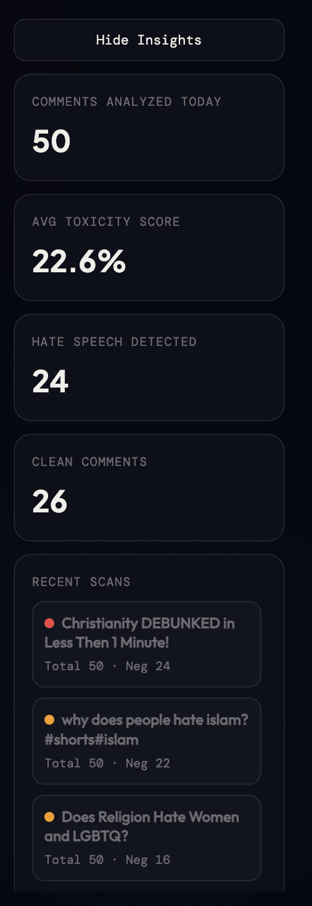

# Hate Speech Detection

A Flask-based NLP project for detecting toxic/hate speech in text across two use cases:
- YouTube comment classification
- Chatroom moderation

## 📸 Screenshots

### 🎯 YouTube Comment Classification

| Home | Analysis Results |
|---|---|
|  |  |

| Comment List | Insights Panel |
|---|---|
|  |  |

### 💬 AI Polite Chat Room

| Chatroom | Polite Conversion | Converted Message |
|---|---|---|
|  |  |  |

---

## Features
- TF-IDF + LinearSVC text classification
- Web interface with Flask
- SocketIO-based interactive behavior
- Saved model artifacts (`best_model.pkl`, `vectorizer.pkl`)

## Model Performance
Best model: **SVM (LinearSVC)**  
Accuracy: **0.7850** (78.50%)  
Macro F1: **0.78**  
Weighted F1: **0.78**  
Test samples: **6424**

## Run (YouTube Module)
```bash
cd "Youtube comment classification"
python app.py
```
Open: `http://127.0.0.1:5001`

_Last updated: Tue May 12 00:18:13 IST 2026_
