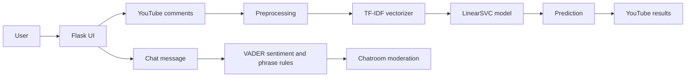

# Hate Speech Detection and Moderation Assistant

[](https://github.com/girishk03/hate-speech-detection/actions/workflows/ci.yml)
[](https://www.python.org/)
[](https://flask.palletsprojects.com/)
[](LICENSE)

## Project Overview

This repository explores assisted text moderation through two Flask applications:

- a YouTube comment classifier built with TF-IDF features and a LinearSVC model; and
- a Socket.IO chatroom that detects strongly negative messages and offers more polite wording.

The trained classifier predicts the repository's three dataset labels—`positive`, `negative`, and `neutral`. These labels are useful moderation signals, but they are not a complete or authoritative definition of hate speech.

## Problem Statement

Online communities need scalable ways to prioritize potentially harmful content without treating an automated prediction as a final moderation decision. This project demonstrates how classical NLP, lightweight web services, and human-facing interventions can support that workflow while keeping the system's limitations visible.

## Use Cases

- Review sentiment-style classifications across public YouTube comments.
- Surface comments that may deserve closer moderator attention.
- Demonstrate real-time message intervention in a Socket.IO chatroom.
- Compare a trained text classifier with a separate rules-and-sentiment moderation approach.

## Live Demo

[Open the combined Flask application](https://hate-speech-detection-zqjy.onrender.com)

The link is the deployment URL recorded by this repository. The combined app uses the same tracked classifier artifacts as the standalone module; `scripts/setup_combined_app.py` places and validates them before startup. Availability is not guaranteed, and free-tier services may sleep, restart, or take time to respond.

## Screenshots

### YouTube Comment Classifier


The values visible in screenshots describe that captured run only; they are not repository-wide performance metrics.

### AI Polite Chatroom


## Architecture

The standalone and combined YouTube interfaces use the saved ML pipeline. The setup script packages the tracked artifacts into the location expected by the combined Flask app; the chatroom uses VADER sentiment and phrase substitutions.



## Repository Structure

```text
hate-speech-detection/
├── .github/workflows/ci.yml          # GitHub Actions pytest workflow
├── Chatroom/                         # Standalone Socket.IO polite-chat application
├── Youtube comment classification/  # Training, inference, dataset, and standalone UI
│   ├── Datasets/                     # CSV data used by training scripts
│   └── models/                       # Saved vectorizer and classifier artifacts
├── combined/                         # Combined Flask application
├── data/                             # Additional repository data assets
├── docs/                             # Provenance notes and screenshots
├── scripts/setup_combined_app.py     # Deterministic model-artifact setup
├── tests/                            # Automated pytest suite
├── pytest.ini                        # Pytest configuration
├── LICENSE                           # MIT license
└── README.md
```

The directory with spaces is retained for compatibility with existing scripts and CI. Quote the path in shell commands.

## Dataset

The training script reads `Youtube comment classification/Datasets/ytfinal.csv`.

| Property | Verified value | Notes |
|---|---:|---|
| Raw rows | 32,120 | Count in `ytfinal.csv` |
| Usable rows | 32,119 | After dropping missing or empty processed text |
| Classes | `positive`, `negative`, `neutral` | Sentiment-style labels, not explicit hate-speech categories |
| Training samples | 25,695 | Stratified 80% split |
| Test samples | 6,424 | Stratified 20% split |
| Split seed | 42 | Set in `model.py` |

The repository also contains `ytdata.csv` and an augmentation script using WordNet substitutions. The original source and license for both training CSVs remain unverified; the repository does not establish a reproducible lineage between them.

## Dataset Provenance

[`docs/dataset_provenance.md`](docs/dataset_provenance.md) records verified row counts, class distributions, preprocessing, file hashes, VADER licensing and citation details, runtime YouTube data considerations, and every unresolved provenance gap. The project MIT license does not relicense third-party or unverified data.

## Preprocessing

`model.py` applies the following transformations before training and inference:

1. Convert text to lowercase.
2. Remove URLs, user mentions, and hashtag markers.
3. Remove non-alphabetic characters.
4. Collapse repeated whitespace.
5. Drop empty processed rows.
6. Transform text with TF-IDF word unigrams and bigrams, English stop words, and a 5,000-feature limit.

## Model Training

The training script compares Logistic Regression, Multinomial Naive Bayes, and LinearSVC on the same stratified split. It selects the model with the highest test accuracy, then stores the selected classifier and fitted vectorizer as Joblib artifacts.

```bash
cd "Youtube comment classification"
python model.py
```

Training overwrites files under `models/`. Review data provenance and evaluation output before publishing newly generated artifacts.

## Model Performance

The checked-in data and training configuration reproduce LinearSVC as the best evaluated model. The figures below are rounded from a local rerun of the code path in `model.py`; they describe this specific held-out split, not expected production performance.

## Evaluation Metrics

| Metric | Value | Notes |
|---|---:|---|
| Accuracy | 78.50% | 5,043 correct predictions across 6,424 test samples |
| Macro F1 | 0.7832 | Gives equal weight to each class |
| Weighted F1 | 0.7845 | Weights each class by its test support |
| Test samples | 6,424 | Stratified 20% holdout with `random_state=42` |

These metrics evaluate `positive`, `negative`, and `neutral` classification. They do not directly measure hate-speech recall, demographic fairness, calibration, or moderation safety.

## How the Chatroom Moderator Works

The standalone and combined chatroom modules do not use the LinearSVC classifier. They:

1. receive messages over Flask-SocketIO;
2. score message sentiment with NLTK VADER;
3. identify sufficiently negative messages using a configured threshold or phrase rules;
4. replace selected terms with a randomly chosen polite alternative; and
5. return or broadcast the original message with the suggested wording.

This mechanism is a demonstration of conversational intervention, not a semantic rewrite system. It can miss harmful language and can change tone without preserving intent.

## Quick Start

```bash
git clone https://github.com/girishk03/hate-speech-detection.git
cd hate-speech-detection
python3 -m venv .venv
source .venv/bin/activate
python -m pip install --upgrade pip
pip install -r combined/requirements.txt
python scripts/setup_combined_app.py
python combined/app.py
```

Open `http://127.0.0.1:5000`. The combined app exposes the YouTube interface at `/youtube` and chatroom at `/chatroom`. The setup script copies both tracked Joblib artifacts to `combined/models/`, validates their inference interfaces, and installs the required NLTK data resources.

On Windows PowerShell, activate the environment with `.venv\Scripts\Activate.ps1`.

## Setup Guide

Use Python 3.11, matching the existing GitHub Actions workflow and deployment runtime. The repository has module-specific dependency files rather than one root requirements file:

- `combined/requirements.txt` for the integrated application;
- `Youtube comment classification/requirements.txt` for the standalone classifier; and
- `Chatroom/requirements.txt` for the standalone chatroom.

The YouTube feature downloads public comments and therefore requires network access. No API key is required by the current downloader implementation.

## Run YouTube Comment Classifier

```bash
source .venv/bin/activate
pip install -r "Youtube comment classification/requirements.txt"
cd "Youtube comment classification"
python app.py
```

Open `http://127.0.0.1:5001`.

## Run AI Polite Chatroom

```bash
source .venv/bin/activate
pip install -r Chatroom/requirements.txt
cd Chatroom
python app.py
```

Open [http://localhost:5002](http://localhost:5002/).

## Testing

The pytest suite contains 13 tests covering preprocessing, saved-model inference, batch prediction, Flask routes, accepted and invalid requests, and chatroom moderation.

```bash
pip install -r requirements-dev.txt
python scripts/setup_combined_app.py
pytest
```

These tests validate existing behavior and artifact compatibility; they do not retrain the model or recalculate the reported evaluation metrics.

## CI/CD

`.github/workflows/ci.yml` runs on pushes and pull requests targeting `main` with Python 3.11. It installs development dependencies, prepares the combined-app artifacts, and fails when pytest fails.

The workflow does not retrain the model, enforce metric thresholds, or deploy the application. The Render configuration in `combined/` provides the deployment entry point, but deployment automation is not defined in this repository.

## Limitations

- Sarcasm, irony, oblique abuse, and reclaimed language may be misclassified.
- The English-oriented cleaner and vectorizer may fail on code-mixed or multilingual text.
- Sentiment labels are only indirect moderation signals and can produce false positives or false negatives.
- LinearSVC decision scores are not calibrated probabilities; confidence-like UI values should not be interpreted as probabilities without calibration.
- Keyword and phrase substitution can miss context or produce awkward rewrites.
- Training-dataset origin, license, and demographic representation remain unverified, limiting redistribution and bias analysis.
- The system is not suitable as the final moderation authority without human review and an appeals process.

## Ethics and Responsible Use

This project is intended to assist moderation and learning, not automate censorship. A real deployment should keep trained reviewers in the decision loop, provide explanations and appeal routes, monitor false-positive rates across communities and language varieties, and document retention and privacy practices.

Training data can encode cultural, demographic, and annotation bias. Evaluate the model on representative data before use, and do not infer a person's character or intent from one classification.

## Future Improvements

- Obtain and version authoritative source, license, and transformation records for both training CSVs.
- Replace sentiment-style labels with a clearly defined moderation taxonomy.
- Expand pytest coverage to asynchronous jobs, external-fetch failures, and Socket.IO event flows.
- Calibrate classifier scores and report per-class confusion matrices.
- Evaluate code-mixed and multilingual language performance.
- Add threshold configuration, moderator feedback, and audit logging.
- Rename the spaced module directory in a coordinated compatibility change.
- Split runtime and development dependencies into locked, reproducible environments.

## License

This project is available under the [MIT License](LICENSE).
